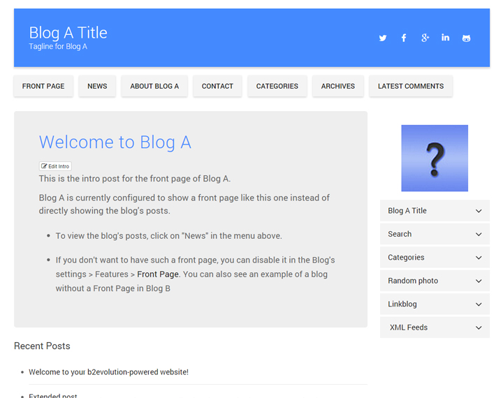
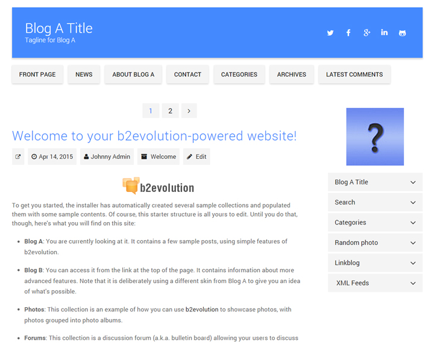
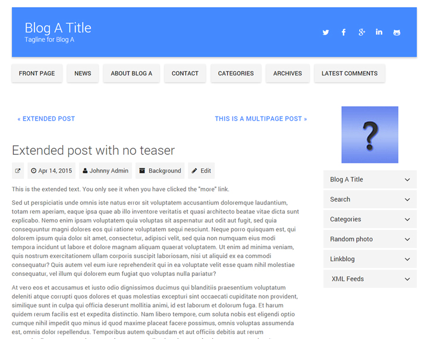

# Material Blog Skin

This is a skin for b2evolution CMS v6.

Link to skin: http://skins.b2evolution.net/material-blog-skin

### Front Page

### Posts Page

### Single Post Page

====

### Update Log:

## v1.1.0-stable
- Implemented LESS modules for different widget layouts
- Implemented meta-comments engine
- Fixed bug with comment forms
- Updated CSS and JS thumbprints for this skin's plugins and libraries
- Item Single widgets enabled for additional back-office customization on disp=single
- Modified back-office customization
- Fixed pagination style issue
- Additional small skin fixes